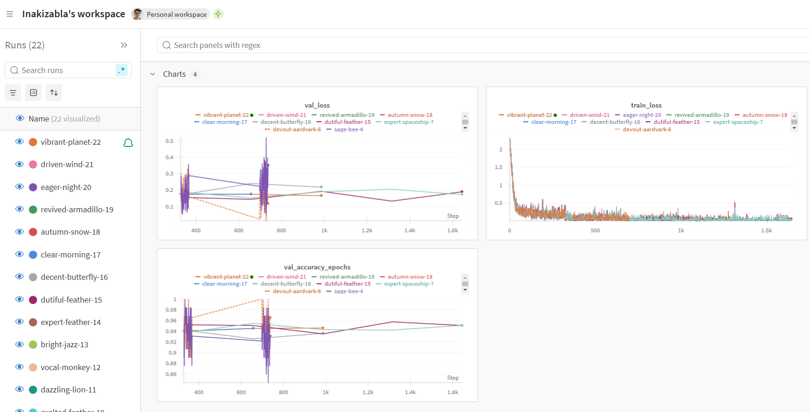

# Exam template for 02476 Machine Learning Operations

This is the report template for the exam. Please only remove the text formatted as with three dashes in front and behind
like:

```--- question 1 fill here ---```

Where you instead should add your answers. Any other changes may have unwanted consequences when your report is
auto-generated at the end of the course. For questions where you are asked to include images, start by adding the image
to the `figures` subfolder (please only use `.png`, `.jpg` or `.jpeg`) and then add the following code in your answer:

```markdown

```

In addition to this markdown file, we also provide the `report.py` script that provides two utility functions:

Running:

```bash
python report.py html
```

Will generate a `.html` page of your report. After the deadline for answering this template, we will auto-scrape
everything in this `reports` folder and then use this utility to generate a `.html` page that will be your serve
as your final hand-in.

Running

```bash
python report.py check
```

Will check your answers in this template against the constraints listed for each question e.g. is your answer too
short, too long, or have you included an image when asked. For both functions to work you mustn't rename anything.
The script has two dependencies that can be installed with

```bash
pip install typer markdown
```

## Overall project checklist

The checklist is *exhaustive* which means that it includes everything that you could do on the project included in the
curriculum in this course. Therefore, we do not expect at all that you have checked all boxes at the end of the project.
The parenthesis at the end indicates what module the bullet point is related to. Please be honest in your answers, we
will check the repositories and the code to verify your answers.

### Week 1

* [X] Create a git repository (M5)
* [X] Make sure that all team members have write access to the GitHub repository (M5)
* [X] Create a dedicated environment for you project to keep track of your packages (M2)
* [X] Create the initial file structure using cookiecutter with an appropriate template (M6)
* [X] Fill out the `data.py` file such that it downloads whatever data you need and preprocesses it (if necessary) (M6)
* [X] Add a model to `model.py` and a training procedure to `train.py` and get that running (M6)
* [X] Remember to fill out the `requirements.txt` and `requirements_dev.txt` file with whatever dependencies that you
    are using (M2+M6)
* [X] Remember to comply with good coding practices (`pep8`) while doing the project (M7)
* [X] Do a bit of code typing and remember to document essential parts of your code (M7)
* [X] Setup version control for your data or part of your data (M8)
* [X] Add command line interfaces and project commands to your code where it makes sense (M9)
* [X] Construct one or multiple docker files for your code (M10)
* [X] Build the docker files locally and make sure they work as intended (M10)
* [X] Write one or multiple configurations files for your experiments (M11)
* [X] Used Hydra to load the configurations and manage your hyperparameters (M11)
* [X] Use profiling to optimize your code (M12)
* [ ] Use logging to log important events in your code (M14)
* [X] Use Weights & Biases to log training progress and other important metrics/artifacts in your code (M14)
* [ ] Consider running a hyperparameter optimization sweep (M14)
* [ ] Use PyTorch-lightning (if applicable) to reduce the amount of boilerplate in your code (M15)

### Week 2

* [X] Write unit tests related to the data part of your code (M16)
* [X] Write unit tests related to model construction and or model training (M16)
* [X] Calculate the code coverage (M16)
* [X] Get some continuous integration running on the GitHub repository (M17)
* [X] Add caching and multi-os/python/pytorch testing to your continuous integration (M17)
* [ ] Add a linting step to your continuous integration (M17)
* [ ] Add pre-commit hooks to your version control setup (M18)
* [X] Add a continues workflow that triggers when data changes (M19)
* [ ] Add a continues workflow that triggers when changes to the model registry is made (M19)
* [X] Create a data storage in GCP Bucket for your data and link this with your data version control setup (M21)
* [X] Create a trigger workflow for automatically building your docker images (M21)
* [X] Get your model training in GCP using either the Engine or Vertex AI (M21)
* [X] Create a FastAPI application that can do inference using your model (M22)
* [X] Deploy your model in GCP using either Functions or Run as the backend (M23)
* [X] Write API tests for your application and setup continues integration for these (M24)
* [X] Load test your application (M24)
* [ ] Create a more specialized ML-deployment API using either ONNX or BentoML, or both (M25)
* [X] Create a frontend for your API (M26)

### Week 3

* [ ] Check how robust your model is towards data drifting (M27)
* [ ] Deploy to the cloud a drift detection API (M27)
* [X] Instrument your API with a couple of system metrics (M28)
* [X] Setup cloud monitoring of your instrumented application (M28)
* [ ] Create one or more alert systems in GCP to alert you if your app is not behaving correctly (M28)
* [ ] If applicable, optimize the performance of your data loading using distributed data loading (M29)
* [ ] If applicable, optimize the performance of your training pipeline by using distributed training (M30)
* [X] Play around with quantization, compilation and pruning for you trained models to increase inference speed (M31)

### Extra

* [ ] Write some documentation for your application (M32)
* [ ] Publish the documentation to GitHub Pages (M32)
* [X] Revisit your initial project description. Did the project turn out as you wanted?
* [ ] Create an architectural diagram over your MLOps pipeline
* [X] Make sure all group members have an understanding about all parts of the project
* [X] Uploaded all your code to GitHub

## Group information

### Question 1
> **Enter the group number you signed up on <learn.inside.dtu.dk>**
>
> Answer:

Group 31

### Question 2
> **Enter the study number for each member in the group**
>
> Answer:

s24084, s204150, s240154, s240076, s240056

### Question 3
> **A requirement to the project is that you include a third-party package not covered in the course. What framework**
> **did you choose to work with and did it help you complete the project?**
>
> Answer:

We used the third-party frameworks TIMM, sci-kit learn in our project. We used functionality train_test_split from modelselection, metrics from sklearn to split effectively the data for training and testing, and implement some metrics in our project. We used TIMM to effectively load in rest-net model and to open the possibility of using other models as well, with ease and to finetune these for our use case. The TIMM framework made it very easy to implement large CNN models as they have much and these can often perform much better than home made models. We ended up choosing RestNet 18 as it's struck a good balance between performance and inference speed according to TIMM's model list. Naturally another model selection could be better in terms of maybe both accuracy and inference, although this would be further investigation of models which was not the goal of this project. 

## Coding environment

> In the following section we are interested in learning more about you local development environment. This includes
> how you managed dependencies, the structure of your code and how you managed code quality.

### Question 4

> **Explain how you managed dependencies in your project? Explain the process a new team member would have to go**
> **through to get an exact copy of your environment.**
>
> Answer:

We used a requirements.txt file, to manage our most necessary libraries and frameworks. At the start we initialized that with 
$ pip list 
$ pip freeze > requirements.txt 
from the conda environment we have created for the project. During the implementation of the project we made sure that each one of use was updating their requirements.txt file and merge them all together at main branch. We ended up having lots of lines that thew weren't required for the project anymore so at the end of the project we used 
$ deptry . in order to find and discard any libraries or frameworks we do not need to include.  

### Question 5

> **We expect that you initialized your project using the cookiecutter template. Explain the overall structure of your**
> **code. What did you fill out? Did you deviate from the template in some way?**
>
> Recommended answer length: 100-200 words
>
> Answer:

From the cookiecutter template we have filled out the data, src and tests folder. We have removed the notebooks folder because we did not use any notebook files in our project and also the file src/animals/visualize.py because we did not implement any visual out of our model . Finally we have removed folder configs because we used another subfolder inside src to host the config files required. We have added a cloudbuild_files folder that contains the cloud files and a folder named profiling in order to keep all the files about profiling. The cookie cutter template helped kickstart the project and managed files consistently across all members of the group.


### Question 6

> **Did you implement any rules for code quality and format? What about typing and documentation? Additionally,**
> **explain with your own words why these concepts matters in larger projects.**
>
> Recommended answer length: 100-200 words.
>
> Answer:

We only set one check in Github Actions for ruff which seems to consistently fail even when the code has been checked, but at least notify us of potential issues in the code formating. We do understand how important these practices are, especially in bigger projects. Keeping code clean and consistent makes it easier to read and work with, and it helps avoid mistakes or confusion between team members. While we mostly agreed informally on how to keep things consistent, following proper coding standards would have made things more organized. Typing and documentation are also really important in larger projects because they help explain the code and prevent errors early on. Typing catches issues while writing the code, and documentation helps everyone understand how things work, both for current team members and anyone joining later.

## Version control

> In the following section we are interested in how version control was used in your project during development to
> corporate and increase the quality of your code.

### Question 7

> **How many tests did you implement and what are they testing in your code?**
>
> Recommended answer length: 50-100 words.
>
> Answer:

In total we have implemented nine tests. Three of them are intended for testing the data, three for our 
model and the other three for our API backend.

For the data part, we made sure that the datasets were initialized in the correct way for both the image and the target. 
We have also included tests that calculate the standard deviation and check that the number of images intended for 
training, testing and validation datasets are correct.

For the model part, we have checked that the output shape matches the expected one for a batch of images and the same 
but with a different input size. Finally, we have tested the model with invalid inputs (e.g., incorrect number of 
channels).

For the API part, we are checking if the backend can be contacted, if it can classify pictures and if it has connection to the cloud bucket.

### Question 8

> **What is the total code coverage (in percentage) of your code? If your code had a code coverage of 100% (or close**
> **to), would you still trust it to be error free? Explain you reasoning.**
>
> Recommended answer length: 100-200 words.
>
> Example:
> *The total code coverage of code is X%, which includes all our source code. We are far from 100% coverage of our **
> *code and even if we were then...*
>
> Answer:

Currently, 69% of the project's code has been covered. Even reaching coverage levels extremely near to 100% does not 
ensure that the software is error- or problem-free, even though a higher coverage percentage is preferable. This 
drawback results from the fact that code coverage quantifies the amount of written code that is executed, but it ignores 
potential use cases, edge situations, and unforeseen circumstances that might occur in practical application. 
Furthermore, code coverage alone may not be sufficient to identify some bug types, such as those brought on by external 
dependencies or integration problems. Therefore, to increase the overall reliability of the product, even though 
increasing coverage is a worthwhile objective, it should be combined with other quality assurance techniques including 
rigorous test design, exploratory testing, and strong user acceptance testing.

### Question 9

> **Did you workflow include using branches and pull requests? If yes, explain how. If not, explain how branches and**
> **pull request can help improve version control.**
>
> Recommended answer length: 100-200 words.
>
> Answer:

To work with version control in our code we have used different branches and pull requests. The tasks were distributed 
among the different team members for further development. For this, each member had his own branch to do the development 
and testing if needed. When one or more tasks were completed, a pull request was created to the main branch. After that, 
the rest of the team members were in charge of bringing the changes from the main branch to their own branch.

### Question 10

> **Did you use DVC for managing data in your project? If yes, then how did it improve your project to have version**
> **control of your data. If no, explain a case where it would be beneficial to have version control of your data.**
>
> Recommended answer length: 100-200 words.
>
> Answer:

We did use DVC to track any changes in the dataset, although we did not update the dataset during our implementation. However, there is a significant advantage to using data version control in a project. It allows teams to keep track of changes made to the dataset over time, ensuring that any modifications, additions, or deletions are recorded and can be easily reverted if needed. This is particularly useful in collaborative projects where multiple team members may work with the same data.

### Question 11

> **Discuss you continuous integration setup. What kind of continuous integration are you running (unittesting,**
> **linting, etc.)? Do you test multiple operating systems, Python  version etc. Do you make use of caching? Feel free**
> **to insert a link to one of your GitHub actions workflow.**
>
> Recommended answer length: 200-300 words.
>
> Answer:

Our continuous integration (CI) setup is organized into a single workflow file designed to ensure comprehensive testing 
across multiple platforms and Python versions. The workflow, named Unit Tests, is triggered on every push and pull 
request to the main branch.

We use a matrix strategy to test the code across three operating systems: Ubuntu, Windows, and macOS, with two Python 
versions: 3.11 and 3.12. This ensures compatibility and robustness of our code across diverse environments.

The workflow is broken into several steps:
- Checkout Code: The code is pulled using the actions/checkout action.
- Set Up Python: We configure Python using actions/setup-python, specifying the Python version from the matrix and 
enabling pip caching. This caching reduces redundant downloads and speeds up the workflow.
- Install Dependencies: Dependencies are installed from the requirements.txt file, followed by the installation of the 
project itself. This step also verifies that the dependencies are correctly resolved.
- Check If Coverage Is Available: Before running the tests, the workflow ensures that coverage and pytest are installed.
- Run Tests & Coverage: Tests are executed using pytest, with coverage used to measure code coverage. A summary report 
is then generated to monitor the extent of test coverage.

Here's the link to the workflow file: [CI File](https://github.com/iasonrap/mlops31/blob/main/.github/workflows/tests.yaml)

## Running code and tracking experiments

> In the following section we are interested in learning more about the experimental setup for running your code and
> especially the reproducibility of your experiments.

### Question 12

> **How did you configure experiments? Did you make use of config files? Explain with coding examples of how you would**
> **run a experiment.**
>
> Recommended answer length: 50-100 words.
>
> Answer:

We used hydra to organize our config file which contains all the hyperparameters for our model and its optimizers, which makes it easy for anyone to replicate our results as they do not have to dig in our code to find this information. To run an experiment in our case we would do $ invoke train after changing the configuration file.

### Question 13

> **Reproducibility of experiments are important. Related to the last question, how did you secure that no information**
> **is lost when running experiments and that your experiments are reproducible?**
>
> Recommended answer length: 100-200 words.
>
> Example:
> *We made use of config files. Whenever an experiment is run the following happens: ... . To reproduce an experiment*
> *one would have to do ...*
>
> Answer:

We set a seed at the start of each model train and we split the data with a seed as well, which should ensure that every run with the same configuration file should produce the same results. Outside of this, we have made use of docker images which are always a direct replication of our repository such a docker image is created whenever we change main branch of our repository. When we run an experiment, we train the model according to the configuration file and save the model weights locally, to wandb and to a cloud bucket, which can be used by the API.

### Question 14

> **Upload 1 to 3 screenshots that show the experiments that you have done in W&B (or another experiment tracking**
> **service of your choice). This may include loss graphs, logged images, hyperparameter sweeps etc. You can take**
> **inspiration from [this figure](figures/wandb.png). Explain what metrics you are tracking and why they are**
> **important.**
>
> Recommended answer length: 200-300 words + 1 to 3 screenshots.
>
> Answer:


WANDB was used to keep track whenever there would be changed to the model, to see how it would impact our validation accuracy and therefore model versioning as well to keep an optimal model and tracking what has already been tried to no waste more time in it. WANDB fortunately has a great visualization of the different validation accuracies but also a great insight into the resources used for each of the models.

### Question 15

> **Docker is an important tool for creating containerized applications. Explain how you used docker in your**
> **experiments/project? Include how you would run your docker images and include a link to one of your docker files.**
>
> Recommended answer length: 100-200 words.
>
> Example:
> *For our project we developed several images: one for training, inference and deployment. For example to run the*
> *training docker image: `docker run trainer:latest lr=1e-3 batch_size=64`. Link to docker file: <weblink>*
>
> Answer:

Docker was used as the preferred way to train our model and ensure anything that worked for someone would work for others. We uploaded docker images to the Artifact registry of Google Cloud Platfrom, which massively simplified the launch of the front and backed of our app. We have the train image build automatically, however the API needs to be build manually and the train image has to be used by vertex AI manually as well. To run 
$ docker pull europe-west1-docker.pkg.dev/mlops31/animals-artifacts/frontend:latest
$ docker pull europe-west1-docker.pkg.dev/mlops31/animals-artifacts/animals_classification:latest
$ docker run
$ docker run

### Question 16

> **When running into bugs while trying to run your experiments, how did you perform debugging? Additionally, did you**
> **try to profile your code or do you think it is already perfect?**
>
> Recommended answer length: 100-200 words.
>
> Answer:

The main way to debug, especially in code was to look at the error messages and narrow down the place the error took place. After that understanding what could have gone wrong, especially considering latest
changes done by you or if a pull request was done, what that could have changed. We did do profiling for train.py and there was nothing major to fix besides the training takes too long for minimum improvements,
our results have been logged under profile_results.prof

## Working in the cloud

> In the following section we would like to know more about your experience when developing in the cloud.

### Question 17

> **List all the GCP services that you made use of in your project and shortly explain what each service does?**
>
> Recommended answer length: 50-200 words.
>
> Answer:

We used 
-Bucket to store our data and track the changes with DVC.
-Artifact Registry to store and manage our Docker container images.
-Cloud Build to trigger a Docker image build on Main Branch push.

### Question 18

> **The backbone of GCP is the Compute engine. Explained how you made use of this service and what type of VMs**
> **you used?**
>
> Recommended answer length: 100-200 words.
>
> Example:
> *We used the compute engine to run our ... . We used instances with the following hardware: ... and we started the*
> *using a custom container: ...*
>
> Answer:

--- question 18 fill here ---

### Question 19

> **Insert 1-2 images of your GCP bucket, such that we can see what data you have stored in it.**
> **You can take inspiration from [this figure](figures/bucket.png).**
>
> Answer:

[Bucket](figures/bucket.png)

### Question 20

> **Upload 1-2 images of your GCP artifact registry, such that we can see the different docker images that you have**
> **stored. You can take inspiration from [this figure](figures/registry.png).**
>
> Answer:

[Artifact Registry](figures/registry.png)

### Question 21

> **Upload 1-2 images of your GCP cloud build history, so we can see the history of the images that have been build in**
> **your project. You can take inspiration from [this figure](figures/build.png).**
>
> Answer:

[Build History](figures/build.png)

### Question 22

> **Did you manage to train your model in the cloud using either the Engine or Vertex AI? If yes, explain how you did**
> **it. If not, describe why.**
>
> Recommended answer length: 100-200 words.
>
> Example:
> *We managed to train our model in the cloud using the Engine. We did this by ... . The reason we choose the Engine*
> *was because ...*
>
> Answer:

--- question 22 fill here ---

## Deployment

### Question 23

> **Did you manage to write an API for your model? If yes, explain how you did it and if you did anything special. If**
> **not, explain how you would do it.**
>
> Recommended answer length: 100-200 words.
>
> Example:
> *We did manage to write an API for our model. We used FastAPI to do this. We did this by ... . We also added ...*
> *to the API to make it more ...*
>
> Answer:

--- question 23 fill here ---

### Question 24

> **Did you manage to deploy your API, either in locally or cloud? If not, describe why. If yes, describe how and**
> **preferably how you invoke your deployed service?**
>
> Recommended answer length: 100-200 words.
>
> Example:
> *For deployment we wrapped our model into application using ... . We first tried locally serving the model, which*
> *worked. Afterwards we deployed it in the cloud, using ... . To invoke the service an user would call*
> *`curl -X POST -F "file=@file.json"<weburl>`*
>
> Answer:

--- question 24 fill here ---

### Question 25

> **Did you perform any unit testing and load testing of your API? If yes, explain how you did it and what results for**
> **the load testing did you get. If not, explain how you would do it.**
>
> Recommended answer length: 100-200 words.
>
> Example:
> *For unit testing we used ... and for load testing we used ... . The results of the load testing showed that ...*
> *before the service crashed.*
>
> Answer:

--- question 25 fill here ---

### Question 26

> **Did you manage to implement monitoring of your deployed model? If yes, explain how it works. If not, explain how**
> **monitoring would help the longevity of your application.**
>
> Recommended answer length: 100-200 words.
>
> Example:
> *We did not manage to implement monitoring. We would like to have monitoring implemented such that over time we could*
> *measure ... and ... that would inform us about this ... behaviour of our application.*
>
> Answer:

--- question 26 fill here ---

## Overall discussion of project

> In the following section we would like you to think about the general structure of your project.

### Question 27

> **How many credits did you end up using during the project and what service was most expensive? In general what do**
> **you think about working in the cloud?**
>
> Recommended answer length: 100-200 words.
>
> Example:
> *Group member 1 used ..., Group member 2 used ..., in total ... credits was spend during development. The service*
> *costing the most was ... due to ... . Working in the cloud was ...*
>
> Answer:

Member s240154 used 2.60$ credits, 

### Question 28

> **Did you implement anything extra in your project that is not covered by other questions? Maybe you implemented**
> **a frontend for your API, use extra version control features, a drift detection service, a kubernetes cluster etc.**
> **If yes, explain what you did and why.**
>
> Recommended answer length: 0-200 words.
>
> Example:
> *We implemented a frontend for our API. We did this because we wanted to show the user ... . The frontend was*
> *implemented using ...*
>
> Answer:

--- question 28 fill here ---

### Question 29

> **Include a figure that describes the overall architecture of your system and what services that you make use of.**
> **You can take inspiration from [this figure](figures/overview.png). Additionally, in your own words, explain the**
> **overall steps in figure.**
>
> Recommended answer length: 200-400 words
>
> Example:
>
> *The starting point of the diagram is our local setup, where we integrated ... and ... and ... into our code.*
> *Whenever we commit code and push to GitHub, it auto triggers ... and ... . From there the diagram shows ...*
>
> Answer:

--- question 29 fill here ---

### Question 30

> **Discuss the overall struggles of the project. Where did you spend most time and what did you do to overcome these**
> **challenges?**
>
> Recommended answer length: 200-400 words.
>
> Example:
> *The biggest challenges in the project was using ... tool to do ... . The reason for this was ...*
>
> Answer:

There were quite some issues with the requirements.txt, lots of libraries being used or added that were not used and having issues with versioning and the docker images related also to that.

### Question 31

> **State the individual contributions of each team member. This is required information from DTU, because we need to**
> **make sure all members contributed actively to the project. Additionally, state if/how you have used generative AI**
> **tools in your project.**
>
> Recommended answer length: 50-300 words.
>
> Example:
> *Student sXXXXXX was in charge of developing of setting up the initial cookie cutter project and developing of the*
> *docker containers for training our applications.*
> *Student sXXXXXX was in charge of training our models in the cloud and deploying them afterwards.*
> *All members contributed to code by...*
> *We have used ChatGPT to help debug our code. Additionally, we used GitHub Copilot to help write some of our code.*
> Answer:

--- question 31 fill here ---
Student s240056 was in charge about buliding the docker image and therefore extended to make sure the requirements were always in line with the code. Also took the task to do some profiling in the code to ensure efficient code.
Student s240154 was in charge of data. Downloaded them and then storage to google Bucket, implement the data.py file. Also initialized the git repo and the Google Cloud project, and then managed to merge all the PRs and create some processes in Google Cloud Platform.
